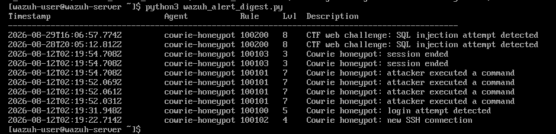
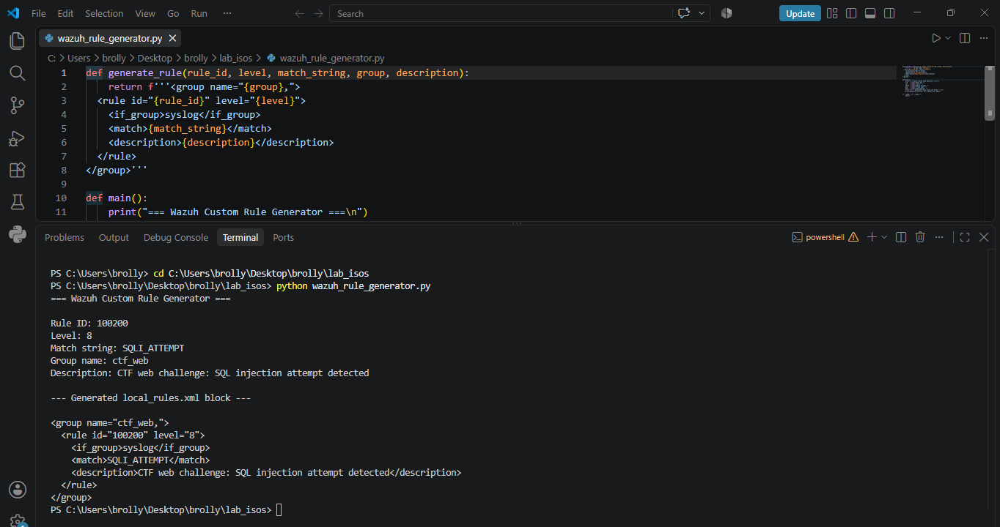
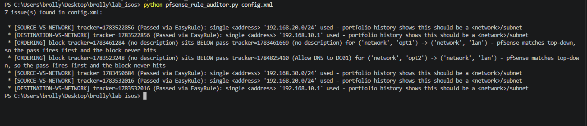

# Cyber Tools & Scripts | Automation Built From the Rest of the Portfolio

## Overview
This bonus project turns manual work performed throughout Network-Lab, SIEM-Lab, Honeypot-Lab, Malware-Analysis, and CTF-Challenges into three focused automation tools — not a generic scripting exercise, but tooling that came directly out of real, repeated tasks across this portfolio: pulling Wazuh alerts by hand, hand-writing custom detection rules, and manually re-checking pfSense firewall rules after the same two misconfigurations kept recurring.

Three tools, done well, beat five done halfway — this project prioritizes depth and reliability over breadth.

---

## Tools & Technologies
- **Languages:** Python
- **Integrations:** Wazuh REST API, pfSense config export
- **Testing environment:** the existing Network-Lab/SIEM-Lab infrastructure

---

## Scripts

### 1. Wazuh Alert Digest
Pulls active alerts via the Wazuh REST API, filters by the custom rules built earlier in this portfolio (`100100`-`100103` from Honeypot-Lab, `100200` from CTF-Challenges), and prints a formatted summary — agent, rule, severity, count. Needs only Wazuh-Manager running, no VM rotation required.

### 2. Wazuh Custom Rule Generator
Takes a rule ID, severity level, match string, group, and description as input, and outputs valid `local_rules.xml` syntax — the exact manual process used repeatedly for Cowrie and the CTF web challenge, now automated. Runs entirely on the host, no VMs needed at all.

### 3. pfSense Rule Auditor
Parses an exported pfSense configuration and flags two specific bug patterns that cost real debugging time across this portfolio: rules using a single "address" instead of a "network/subnet," and Block rules positioned below a Pass rule for the same source/destination. Needs only a one-time config export from pfSense — no live VM interaction required to run the audit itself.

**Known limitation:** the ordering check flags any Block rule sitting below a same-zone Pass rule. This correctly catches accidentally-shadowed blocks, but also flags the standard "specific allow, then general deny" firewall pattern (e.g. an explicit DNS-allow rule placed above a broader block) as a false positive. Address-vs-network findings are reliable and actionable; ordering findings require manual review before acting on them.

---

## What each script targets

| Script | Reads from | VM(s) needed to run |
|---|---|---|
| Wazuh Alert Digest | Wazuh-Manager REST API (192.168.30.20:55000) | Wazuh-Manager only |
| Wazuh Rule Generator | Standalone — generates config, no live target | None |
| pfSense Rule Auditor | Exported pfSense `config.xml` | None (after a one-time export) |

---

## Setup Steps
1. Clone the repository to the host machine (these tools manage the lab from outside it, not from inside any VM).
2. Install dependencies: `pip install requests`.
3. Configure API credentials in a local `.env` file — a `.env.example` template is provided; **the real `.env` is gitignored and never committed.**
4. Run each script against the live lab environment and capture output.

---

## Screenshots / Proof

---

## Challenges
- **Avoiding "toy script" territory.** The original draft included generic examples (a basic ping sweep, a generic log parser) disconnected from the rest of the portfolio. Every script here was deliberately scoped down to only what actually automates a real, previously-manual task from an earlier project.
- **Deciding what NOT to build.** A VM Rotation Manager and a malware static-analysis triage tool were both planned early on, but building five scripts at the same depth as three would have meant less polish across the board — cut to three to keep quality consistent, and moved the other two ideas to Next Steps instead.
- **API authentication without hardcoding secrets.** Used a `.env` file excluded via `.gitignore`, with a checked-in `.env.example` template.
- **The ordering heuristic can't distinguish intentional design from a real bug.** A live run against the actual pfSense config found 7 flagged items: 5 genuine address-vs-network issues (several traced back to rules auto-created by pfSense's "Passed via EasyRule" feature), and 2 ordering flags that turned out to be deliberate — a specific DNS-allow rule placed above a broader block, added earlier in SIEM-Lab to fix a real connectivity issue. Rather than silently over-claiming "7 bugs found," the script's output and this README are explicit that ordering findings need manual review, while address-vs-network findings are directly actionable.

---

## Learning Notes
- The most valuable automation targets weren't invented — they were the tasks that felt repetitive while actually doing the other five projects.
- Wrapping an API (Wazuh) is a different skill from using its web UI — authentication tokens, correct endpoints, and error handling all matter in ways the dashboard hides.
- Automating your own past mistakes (the pfSense "address vs subnets" bug, specifically) is a very concrete way to demonstrate you actually learned from them.
- Scoping down from five tools to three, deliberately, produced a stronger result than trying to finish all five — knowing when to cut scope is itself a professional skill worth documenting.

---

## Next Steps
- VM Rotation Manager (PowerShell/Bash + `vmrun`) — enforce the "never more than 3 VMs" RAM budget that was tracked manually throughout this whole portfolio.
- Safe static-analysis triage script — batch VirusTotal hash lookups, building on the Malware-Analysis workflow without ever executing samples.
- Package the Wazuh Alert Digest as a scheduled task for continuous monitoring rather than on-demand runs.

---

**Author:** Ayoub Khachane

**Related Projects:** [Network-Lab](https://github.com/ayoubkhachane/Network-Lab) · [SIEM-Lab](https://github.com/ayoubkhachane/SIEM-Lab) · [Honeypot-Lab](https://github.com/ayoubkhachane/Honeypot-Lab) · [Malware-Analysis](https://github.com/ayoubkhachane/Malware-Analysis) · [CTF-Challenges](https://github.com/ayoubkhachane/CTF-Challenges)
